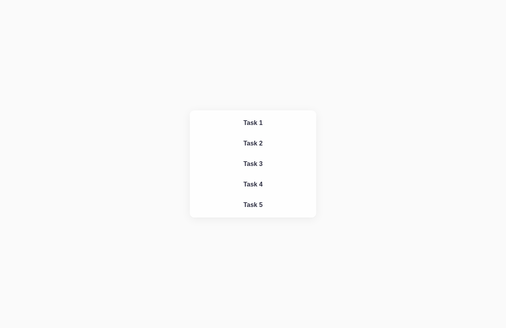

<!-- AUTOGEN:STATS -->
[](https://developer.mozilla.org/en-US/docs/Web/HTML) [](https://developer.mozilla.org/en-US/docs/Web/JavaScript) [](https://support.apple.com/guide/terminal/welcome/mac) [](https://code.visualstudio.com/) [](https://github.com/) [](https://www.figma.com/) 

[](https://github.com/VuToV-Mykola/goit-js-hw-06/graphs/traffic)
[](https://github.com/VuToV-Mykola/goit-js-hw-06/actions/workflows/screenshot-and-visitor.yaml)
[](https://github.com/VuToV-Mykola/goit-js-hw-06)
[](https://github.com/VuToV-Mykola/goit-js-hw-06/blob/main/LICENSE)

## 📸 Скріншот проекту

<!-- END:AUTOGEN -->

## My Achievements


## My Certificates - Completed Sololearn Course:


[SOLOLEARN](https://www.sololearn.com/certificates/CT-VJXN3HQH)

# JavaScript Homework 06

## About

📌 GoIT Homework-JS #6: Object methods, Classes, Private properties - refactoring and building storage/string management systems.

## Task 1. User Account

**COMPLETE THIS TASK IN THE FILE `task-1.js`**

Before being fired, a developer broke the source code for managing user accounts in our food delivery service. Perform refactoring of the `customer` object methods by adding the missing `this` when accessing object properties.

Use this starter code and perform refactoring. After declaring the object, we added method calls. The console will display the results of their work. Please don't change anything there.

```javascript
const customer = {
  username: "Mango",
  balance: 24000,
  discount: 0.1,
  orders: ["Burger", "Pizza", "Salad"],
  // Change code below this line
  getBalance() {
    return balance;
  },
  getDiscount() {
    return discount;
  },
  setDiscount(value) {
    discount = value;
  },
  getOrders() {
    return orders;
  },
  addOrder(cost, order) {
    balance -= cost - cost * discount;
    orders.push(order);
  },
  // Change code above this line
};

customer.setDiscount(0.15);
console.log(customer.getDiscount()); // 0.15
customer.addOrder(5000, "Steak");
console.log(customer.getBalance()); // 19750
console.log(customer.getOrders()); // ["Burger", "Pizza", "Salad", "Steak"]
```

Leave this code for mentor verification.

### Mentor Review Criteria

- Declared variable `customer`
- The value of variable `customer` is an object with properties and methods
- Calling `customer.getDiscount()` returns the current value of the `discount` property
- Calling `customer.setDiscount(0.15)` updates the value of the `discount` property
- Calling `customer.getBalance()` returns the current value of the `balance` property
- Calling `customer.getOrders()` returns the current value of the `orders` property
- Calling `customer.addOrder(5000, "Steak")` adds `"Steak"` to the array of values of the `orders` property and updates the balance
- The `getBalance` method of the `customer` object uses `this`
- The `getDiscount` method of the `customer` object uses `this`
- The `setDiscount` method of the `customer` object uses `this`
- The `getOrders` method of the `customer` object uses `this`
- The `addOrder` method of the `customer` object uses `this`

## Task 2. Storage

**COMPLETE THIS TASK IN THE FILE `task-2.js`**

Create a `Storage` class that will create objects for managing a warehouse of goods. The class expects only one argument — the initial array of goods, which is written to the created object in the private property `items`.

Declare the following class methods:

- `getItems()` — returns an array of current goods in the private property `items`.
- `addItem(newItem)` — accepts a new item `newItem` and adds it to the array of goods in the private property `items` of the object.
- `removeItem(itemToRemove)` — accepts a string with the name of the item `itemToRemove` and removes it from the array of goods in the private property `items` of the object.

Take the code below with instance initialization and method calls and insert it after declaring the class to check the correctness of its work. The console will display the results of their work. Please don't change anything there.

```javascript
const storage = new Storage(["Nanitoids", "Prolonger", "Antigravitator"]);
console.log(storage.getItems()); // ["Nanitoids", "Prolonger", "Antigravitator"]

storage.addItem("Droid");
console.log(storage.getItems()); // ["Nanitoids", "Prolonger", "Antigravitator", "Droid"]

storage.removeItem("Prolonger");
console.log(storage.getItems()); // ["Nanitoids", "Antigravitator", "Droid"]

storage.removeItem("Scaner");
console.log(storage.getItems()); // ["Nanitoids", "Antigravitator", "Droid"]
```

Leave this code for mentor verification.

### Mentor Review Criteria

- Declared class `Storage`
- Method `getItems` is declared in the `Storage` class
- Method `addItem` is declared in the `Storage` class
- Method `removeItem` is declared in the `Storage` class
- Property `items` in the `Storage` class is declared as private
- Method `getItems` returns the value of the private property `items` of the class instance that calls it
- Method `addItem` changes the value of the private property `items` of the class instance that calls it
- Method `removeItem` changes the value of the private property `items` of the class instance that calls it
- As a result of calling `new Storage(["Nanitoids", "Prolonger", "Antigravitator"])`, the value of variable `storage` is an object
- Object `storage` has no public property `items`
- First call `storage.getItems()` immediately after instance initialization returns the array `["Nanitoids", "Prolonger", "Antigravitator"]`
- Second call `storage.getItems()` after calling `storage.addItem("Droid")` returns the array `["Nanitoids", "Prolonger", "Antigravitator", "Droid"]`
- Third call `storage.getItems()` after calling `storage.removeItem("Prolonger")` returns the array `["Nanitoids", "Antigravitator", "Droid"]`
- Fourth call `storage.getItems()` after calling `storage.removeItem("Scaner")` returns the array `["Nanitoids", "Antigravitator", "Droid"]`

## Task 3. String Builder

**COMPLETE THIS TASK IN THE FILE `task-3.js`**

Write a `StringBuilder` class that accepts one parameter `initialValue` — an arbitrary string, which is written to the private property `value` of the created object.

Declare the following class methods:

- `getValue()` — returns the current value of the private property `value`.
- `padEnd(str)` — receives parameter `str` (string) and adds it to the end of the value of the private property `value` of the object that calls this method.
- `padStart(str)` — receives parameter `str` (string) and adds it to the beginning of the value of the private property `value` of the object that calls this method.
- `padBoth(str)` — receives parameter `str` (string) and adds it to the beginning and end of the value of the private property `value` of the object that calls this method.

Take the code below with instance initialization and method calls and insert it after declaring the class to check the correctness of its work. The console will display the results of their work. Please don't change anything there.

```javascript
const builder = new StringBuilder(".");
console.log(builder.getValue()); // "."

builder.padStart("^");
console.log(builder.getValue()); // "^."

builder.padEnd("^");
console.log(builder.getValue()); // "^.^"

builder.padBoth("=");
console.log(builder.getValue()); // "=^.^="
```

Leave this code for mentor verification.

### Mentor Review Criteria

- Declared class `StringBuilder`
- Property `value` in the `StringBuilder` class is declared as private
- Method `getValue` is declared in the `StringBuilder` class
- Method `getValue` returns the value of the private property `value` of the class instance that calls it
- Method `padEnd` is declared in the `StringBuilder` class
- Method `padEnd` changes the value of the private property `value` of the class instance that calls it
- Method `padStart` is declared in the `StringBuilder` class
- Method `padStart` changes the private property `value` of the class instance that calls it
- Method `padBoth` is declared in the `StringBuilder` class
- Method `padBoth` changes the value of the private property `value` of the class instance that calls it
- As a result of calling `new StringBuilder(".")`, the value of private variable `builder` is an object
- Object `builder` does not contain a public property `value`
- First call `builder.getValue()` immediately after instance initialization returns the string `.`
- Second call `builder.getValue()` after calling `builder.padStart("^")` returns the string `^.`
- Third call `builder.getValue()` after calling `builder.padEnd("^")` returns the string `^.^`
- Fourth call `builder.getValue()` after calling `builder.padBoth("=")` returns the string `=^.^=`
